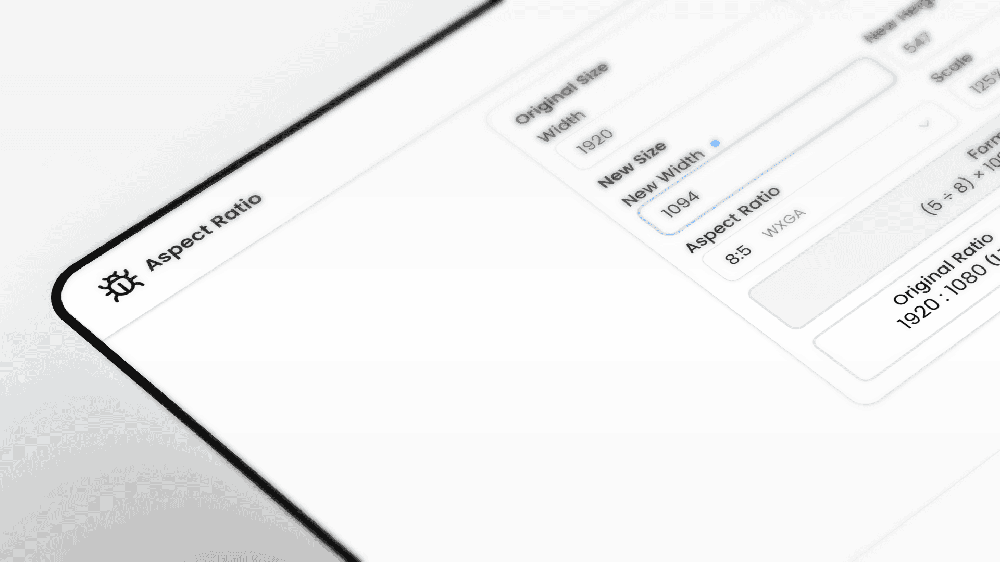

# Aspect Ratio Calculator

A powerful and intuitive aspect ratio calculator built with React and TypeScript. The calculator helps designers, photographers, and developers maintain proportions when resizing images, videos, and other rectangular objects.



## Features

- **Automatic Proportion Calculation**: Maintains aspect ratios when resizing dimensions
- **Preset Formats**: Support for common ratios (16:9, 4:3, 8:5, 1:1, 3:2, 21:9)
- **Flexible Scaling**: Scale from 25% to 500% in 25% increments
- **Leading Dimension Control**: Choose width or height as the base calculation parameter
- **Quick Dimension Swap**: Instantly swap width and height values
- **Real-time Formula Display**: Shows the mathematical formula for current calculations
- **Result Comparison**: Displays original and new aspect ratios with precise values
- **Responsive Design**: Works seamlessly across all device sizes
- **Accessibility**: Full keyboard navigation and screen reader support

## Implementation Details

### Component Structure

The aspect ratio calculator consists of:

- Input fields for original dimensions (width and height)
- Aspect ratio selector with preset formats
- Scale slider for resizing (25% - 500%)
- Leading dimension toggle (width/height)
- Results display with calculated dimensions and formulas

### State Management

The component uses a custom `useAspectRatio` hook to manage:

- Original dimensions (width and height)
- Selected aspect ratio format
- Scale percentage
- Leading dimension preference
- Calculated results

### Calculation Algorithm

The core calculation formula:

```typescript
// Formula for calculating dependent dimension
const k = (lead === 'width' ? ratio.h / ratio.w : ratio.w / ratio.h) * (scale / 100);
const dependentSize = Math.round(leadingSize * k);
```

### Supported Aspect Ratios

- **16:9**: Widescreen format (Full HD, 4K displays)
- **4:3**: Classic format (traditional monitors, photography)
- **8:5**: WXGA format
- **1:1**: Square format (Instagram posts)
- **3:2**: Photography standard
- **21:9**: Ultra-wide format (cinema, gaming)

## Code Example

```tsx
// Basic usage of the aspect ratio calculator
import AspectRatioCalculator from './AspectRatioCalculator';

const App = () => {
  return (
    <div className="container">
      <AspectRatioCalculator />
    </div>
  );
};
```

## Technical Implementation

The component uses:

- **React Hooks**: Custom hook `useAspectRatio` for state management and calculations
- **TypeScript**: Complete type safety with custom interfaces
- **Performance Optimization**: `useMemo` and `useCallback` for efficient rendering
- **Shadcn UI Components**: Card, Button, Input, and Select components for consistent styling
- **Lucide React**: SVG icons for enhanced user interface

### Type Definitions

- `AspectRatio`: Defines width and height ratio structure
- `LeadingDimension`: Type for choosing between 'width' or 'height'
- `ScaleValue`: Range type for scaling percentages (25-500)

### Key Features

1. **Dynamic Calculations**: Real-time updates as users modify inputs
2. **Boundary Validation**: Ensures valid dimension values and scale ranges
3. **Visual Feedback**: Active field highlighting and clear result display
4. **Formula Transparency**: Shows calculation methodology to users

## Usage Examples

### Web Design
```
Original: 1920x1080 (16:9)
Scaled: 960x540 (maintains 16:9, 50% scale)
```

### Print Media
```
Original: 3000x2000 (3:2)
Resized: 1500x1000 (maintains 3:2, 50% scale)
```

### Social Media
```
Original: 1200x800 (3:2)
Instagram: 1080x1080 (converted to 1:1 square)
```

## Accessibility

The calculator implements comprehensive accessibility features:

- ARIA labels for all interactive elements
- Keyboard navigation support for all controls
- Screen reader announcements for calculation results
- High contrast visual design for better visibility
- Focus management for optimal user experience

## Browser Compatibility

This component is compatible with all modern browsers:

- Chrome, Firefox, Safari, Edge (latest versions)
- Mobile browsers on iOS and Android
- Supports ES6+ features with proper transpilation

## License

This project is part of a larger Next.js collection and is available under the MIT license.
