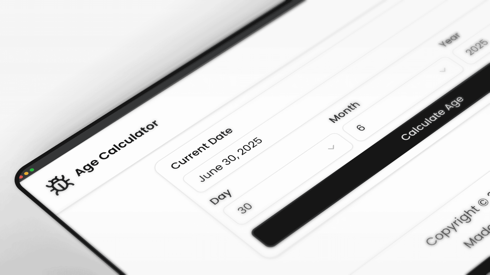

# Age Calculator

A comprehensive age calculator built with Next.js and React that provides detailed age information and fun facts based on birth date.



## Features

- **Precise Age Calculation**: Calculate exact age in years, months, and days
- **Birthday Countdown**: See how many days, hours, minutes, and seconds until your next birthday
- **Half Birthday**: Find out when your half birthday occurs
- **Planetary Ages**: Discover your age on other planets in our solar system
- **Life Statistics**: View interesting facts about your life such as breaths taken, heartbeats, and more
- **Data Persistence**: Automatically saves your calculations and form data to localStorage
- **Responsive Design**: Works seamlessly on both desktop and mobile devices

## Implementation Details

### Component Structure

The age calculator is built with the following structure:

```
AgeCalculator
├── Date Input Form
│   ├── Current Date Input
│   ├── Birth Date Inputs (Day, Month, Year)
│   └── Calculate Button
└── Results Display
    ├── Age Result
    ├── Next Birthday Information
    ├── Birthday Countdown
    ├── Half Birthday Information
    ├── Planetary Ages
    └── Life Statistics
```

### State Management

- Uses Redux Toolkit for global state management
- Implements `useForm` from React Hook Form for form handling
- **localStorage Integration**: Uses custom `useStorage` hook for automatic data persistence
  - Saves calculation results and form state automatically
  - Restores previous data on page reload
  - Synchronizes data across browser tabs
- Uses `useCallback` and `useMemo` for optimized performance
- Implements proper TypeScript types for type safety

### Calculations

- Accurately calculates age in years, months, and days with proper adjustments
- Computes next birthday and countdown with precise time
- Calculates half birthday date
- Converts Earth age to ages on other planets based on orbital periods
- Generates interesting life statistics based on age in days

## Technical Implementation

The component uses:

- Next.js for the framework
- Redux Toolkit for global state management
- React Hook Form for form handling
- **Custom useStorage hook** for localStorage integration with type safety
- TypeScript for type safety
- UI components from a shared component library
- TailwindCSS for styling and responsive design

### Data Persistence

The age calculator automatically saves and restores:

- Calculation results (age, fun facts, birthday countdowns)
- Current date selection
- Calendar state (selected date and month)
- Form input values

Data is stored in localStorage with the key `age-calculator-data` and is automatically synchronized across browser tabs.

## Accessibility

The age calculator component implements the following accessibility features:

- Semantic HTML structure
- Proper form labeling
- Keyboard navigable interface
- Clear visual indicators for interactive elements

## Browser Compatibility

This component is compatible with all modern browsers:

- Chrome, Firefox, Safari, Edge (latest versions)
- Mobile browsers on iOS and Android

## License

This project is part of a larger Next.js collection and is available under the MIT license. 